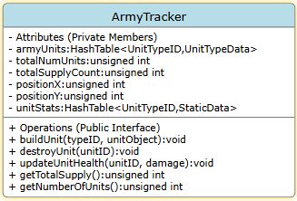

---
header-includes:
  - \usepackage{float}
---

# Using Hash Tables to run (an) Army(ies) for Real Time Strategy

## Intro & Philosophy:

&nbsp;&nbsp;&nbsp;&nbsp; Working with a data multiset to create the basis to store something viable for a game, I chose to work with 
the idea of a real time strategy game (RTS).  I want to keep army unit maintenance inside a hash table<string, 
unsigned int>. For this project, I will need the system to be able to flexibly alter unit status to include upgrades, 
damage taken, health points, cost to build, and unit value (e.g. a Marine may be worth one while a Tank can be worth 6.) 
As units are damaged and killed I need them removed from the table. I need to implement this for the production company
RipRTSOff so that the program can manage its units inside the game environment for an end user gamer. 

## Core Operations:

&nbsp;&nbsp;&nbsp;&nbsp; The core operations of this bag should work as follows (somewhat previously explained): damage progression/ability, unit
cost (both monetary and time), unit army value, total army count, and unit position. This will likely need to be a 
hash table of hash tables. Most operations should be O(1) as one can, " The indexes of the array are computed using a hash
function. hash table structures have a remarkable property: most of their operations are (amortized, average, etc.) 
constant time, that is, their theoretical complexity is 𝒪(1)."[1] For example, first determine the type of unit to be 
attacked, like a tank. Then, from that hash table find the specific ID of the one being attacked and alter the unit as 
needed. Problems may occur when 8 units attack at the same time one unit and do way more damage than the total health 
of the unit being attacked. Also, the unit could already be dead when the damage vector is on route. However, there is 
one factor that will be O(N), that is the total army count (if counting the whole army each time.) this can be mitigated
with a increment/decrement upon each unit creation and deletion.

### Example Pseudo-code

Function Initialize Army Tracker(listOfAllUnitTypes)

&nbsp;&nbsp;&nbsp;&nbsp; armyTracker.tableUnits = new HashTable<unitGenID, unitTypeAndData>()\
&nbsp;&nbsp;&nbsp;&nbsp; set unit count to 0\
&nbsp;&nbsp;&nbsp;&nbsp; set supply to 0

&nbsp;&nbsp;&nbsp;&nbsp; For every unitGenID in listOfAllUnitTypes\
&nbsp;&nbsp;&nbsp;&nbsp;&nbsp;&nbsp;&nbsp;&nbsp; new_unitTypeTable = new HashTable<unitID, unitObj>\
&nbsp;&nbsp;&nbsp;&nbsp;&nbsp;&nbsp;&nbsp;&nbsp; Add the unit Table to the Army Table

Function Create Unit(unitGeneratorID, unitGeneratorLocation)

&nbsp;&nbsp;&nbsp;&nbsp; Assign Serialized ID\
&nbsp;&nbsp;&nbsp;&nbsp; Create UnitItem\
&nbsp;&nbsp;&nbsp;&nbsp; Load Standard values\
&nbsp;&nbsp;&nbsp;&nbsp; Set at map location (TBD by buildings and their Locations in the future)\
&nbsp;&nbsp;&nbsp;&nbsp; Load the specifics (for example actual starting health, energy, shields {if any})

&nbsp;&nbsp;&nbsp;&nbsp; Insert the Unit 

&nbsp;&nbsp;&nbsp;&nbsp; return serialized ID

## Set Operations:

&nbsp;&nbsp;&nbsp;&nbsp; There are several different set operations that may be of use. For example in many games one can creat specific subsets 
of units in one's army. Also, to compare different strengths, one must also be able to compare where the army's 
intersect and where they have difference It is also useful to determine what upgrades one army may have that the other
does not. For example if there is a scenario where the enemy is supposed to achieve final victory no matter what the 
player does, the difference one will reveal weaknesses for further unit generation to wipe out the player.

## Extension Feature:

&nbsp;&nbsp;&nbsp;&nbsp; In order for game play to be satisfying to the player, there needs to pleasing mecanics, 
dynamics, and aesthetics. As described in "MDA: A Formal Approach to Game Design and Game Research":

>>Aesthetics What makes a game "fun"? How do we know a specific type of fun when we see it?...Dynamics work to create 
> aesthetic experiences. For example, challenge is created by things like time pressure and opponent play. Fellowship 
> can be encouraged by sharing information across certain members of a session (a team) or supplying winning conditions 
> that are more difficult to achieve alone (such as capturing an enemy base)...Mechanics are the various actions, 
> behaviors and control mechanisms afforded to the player within a game context. Together with the gameís content 
> (levels, assets and so on) the mechanics support overall gameplay dynamics.[2]

Using one unit and another with the addition of an appropriate amount of time, there can be two separate units that 
merge into a single better unit. For example, if the player has a marine and robotic "AI" armor, the two units could 
merge to form the "starship trooper ape unit or at least a differently named facsimile of one. With this action, it 
gives another avenue for the player to progress in power without the creation of new units when unit capped for total 
supply. With the addition of more types of armies, this ability can be added in different versions to each. For example,
one could be available early in the game to an army, but it would not have as much added strength as that for the 
army(ies) that have to wait longer to gain the ability.

## Trade-off Analysis:

| Sequence | AVLTree |
|----------|---------|
| **Description** | **Description** |
| This is basically an array. Each Item is stored individually and one must iterate through the whole list every single time you have to add subtract or find and given item. | An AVLTree is a for of tree search structure and a very effective way to search through for numeric values, especially when they are unique.|
| **Why is this a problem?** | **Why is this a problem?** |
| As the army increases for each player, there are ever more items to run through. Even with a sequence of sequences the whole proces is complicated and cumberson in relation to being able to just go to a bucket to find the type and then a bucket in the sub hash table to get to the specific unit.| As the army increases for each player, there's continual additions to the tree. This is not quite so problematic though as there is still the possibility of num type that subtrees but it is much easier to serialize and subtable as the tree  best case scenario is log₂ N. |

&nbsp;&nbsp;&nbsp;&nbsp; In summary while both are able to be used and traited, neither of them are quite so efficient 
as a hash table that can be run as O(1). Further, it feels easier to think about the traits inside the hash table bucket
vis-à-vis the node structure or the list style of the sequence. Were the structure that was being worked on a crafting 
from inventory type, I would choose the Sequence type as all one needs to do is find first occurrence of limited types 
of object, remove it and then output the crafted item.

## Alternative design sketch:

### AVLTree

\begin{figure}[H]
\centering
\includegraphics[width=0.8\textwidth]{AVLTreeProj6.jpg}
\caption{Alternative design sketch - AVLTree}
\vspace{1em}
\end{figure}

&nbsp;&nbsp;&nbsp;&nbsp; The above flow chart is jus the start of what would need to be done to start out fleshing out 
what would be necessary to complete a flow chart just to start getting to the units. Although log2 N is not 
long it is still far longer than O(1) that a hash table would require to find the location of the hashed unit type. <i>
(See Below)</i>

\begin{figure}[H]
\centering
\includegraphics[width=0.7\textwidth]{img_3.png}
\caption{Alternative design sketch - Hash Table}
\vspace{1em}
\end{figure}

## Evaluation Plan

&nbsp;&nbsp;&nbsp;&nbsp; I would test this format by first running through a debug program like we have through our projects. I would start with testing each variable through input validation and then standardized names to see what was returned and if it worked properly in the context of a hash table. After I would add the sub-variables to each general type, I would also verify that each of those returned the proper values. Next, I would test the hash table's hashtable for the individual values. one all those returned properly through try catch debugging, I would then link the tables properly with the secondary unit specific tables subservient to the primary tables.

## Conclusion

&nbsp;&nbsp;&nbsp;&nbsp;

[1] S. Tapia-Fernández, D. García-García, and P. García-Hernandez, "Key Concepts, Weakness and Benchmark on Hash Table 
Data Structures," Algorithms, vol. 15, no. 3, p. 100, Mar. 2022

[2]R. Hunicke, M. LeBlanc, and R. Zubek, "MDA: A Formal Approach to Game Design and Game Research," in Proceedings of 
the AAAI Workshop on Challenges in Game AI, San Jose, CA, USA, Jul. 2004, vol. 4, no. 1, p. 4